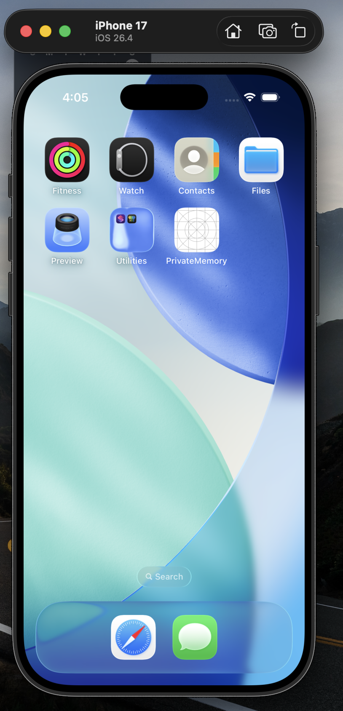
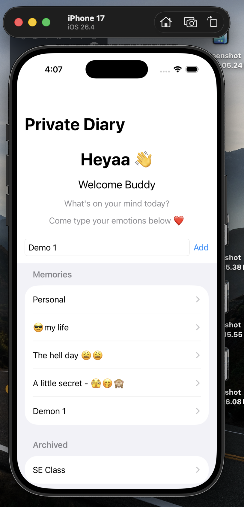
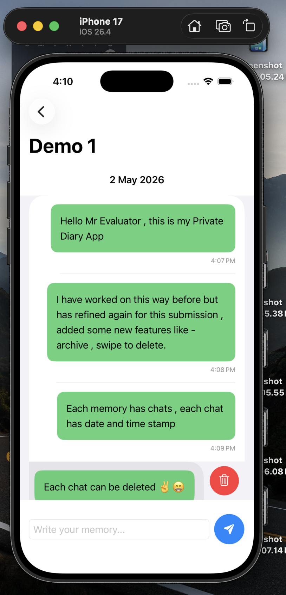
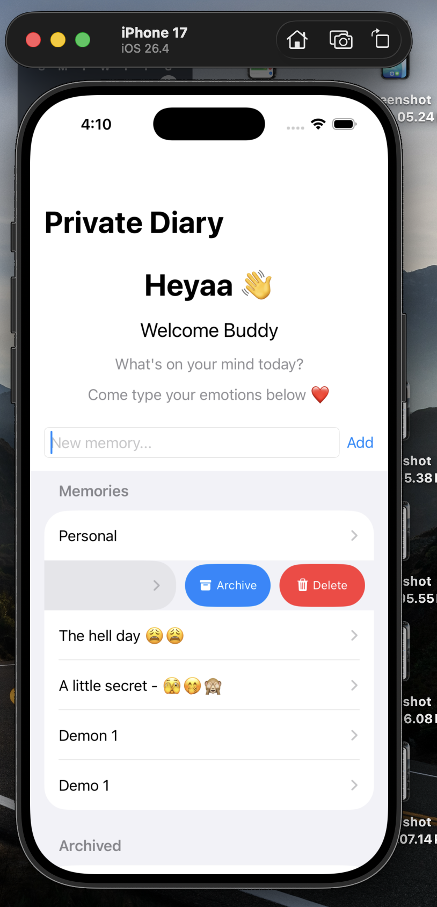
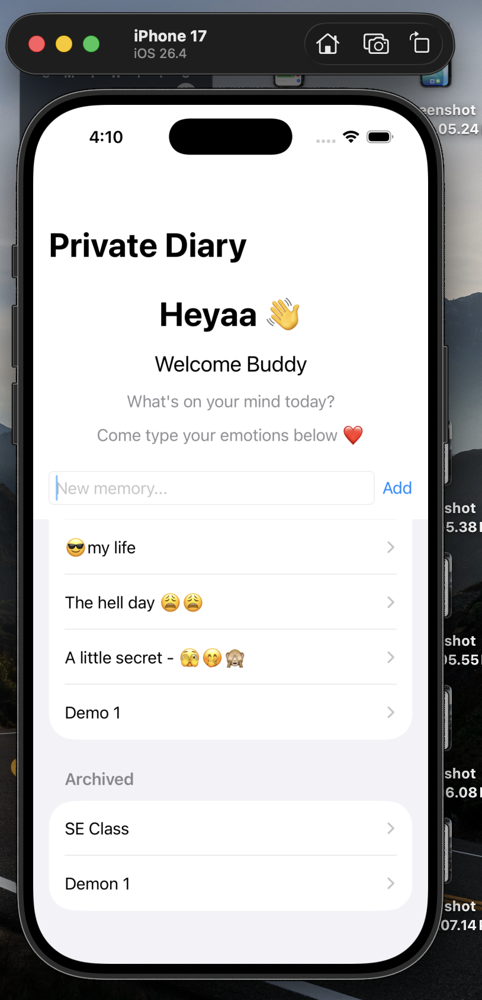

# 📱 PrivateMemory — Chat-Based Diary App (SwiftUI)

> A clean, chat-inspired private diary app built using SwiftUI.  
> Organize memories, write thoughts like conversations, and manage entries with intuitive swipe actions.

---

## ✨ Features

- 💬 Chat-style diary entries  
- 🗂 Folder-based memory organization  
- 🕒 Automatic date & time stamps  
- 🗑 Delete individual chats  
- 📦 Archive memories with swipe gesture  
- 👆 Smooth iPhone-first UI experience  
- ⚡ Lightweight and fast  

---

## 📸 App Preview

### 📱 App Installed on iPhone
<p align="center">
  
</p>

📝 The app appears on the iPhone home screen. click it and see magic !

---

### 🏠 Dashboard – Create & View Memories
<p align="center">
  
</p>

📝 Main screen where users can create new memories and view existing ones in a clean, organized list.

---

### 💬 Inside a Memory – Chat Interface
<p align="center">
  
</p>

📝 Each memory opens like a chat conversation with Date on top and timestamped entries and the ability to delete individual messages.

---

### ⚡ Swipe Actions – Archive & Delete
<p align="center">
  
</p>

📝 Swipe gestures allow quick actions like archiving or deleting memories for a smooth user experience.

---

### 📦 Archived Section – Organized Storage
<p align="center">
  
</p>

📝 Archived memories are stored separately, helping keep the main dashboard clean and focused.

---

## 🛠 Tech Stack

- **Language:** Swift  
- **Framework:** SwiftUI  
- **Platform:** iOS  
- **IDE:** Xcode  

---

## 🚀 How to Run

1. Clone the repository  
   ```bash
   git clone https://github.com/YOUR_USERNAME/PrivateMemory-IOS_app.git
2. Open in Xcode
3. Select an iPhone simulator
4. Run the project ▶️

----

Project Highlights
Designed with mobile-first UX principles
Focus on simplicity + usability
Mimics real-world apps with gesture-based interactions
Built as a portfolio-ready iOS application

---

📌 Future Improvements
🔐 Face ID / Passcode lock
☁️ Cloud sync (iCloud / Firebase)
🎨 UI/UX enhancements
🔎 Search & filter memories

---

👨‍💻 Author

Prabhanshu Yadav
iOS Developer | SwiftUI Learner |
---


⭐ If you like this project

Give it a star ⭐ on GitHub — it helps a lot!


   
